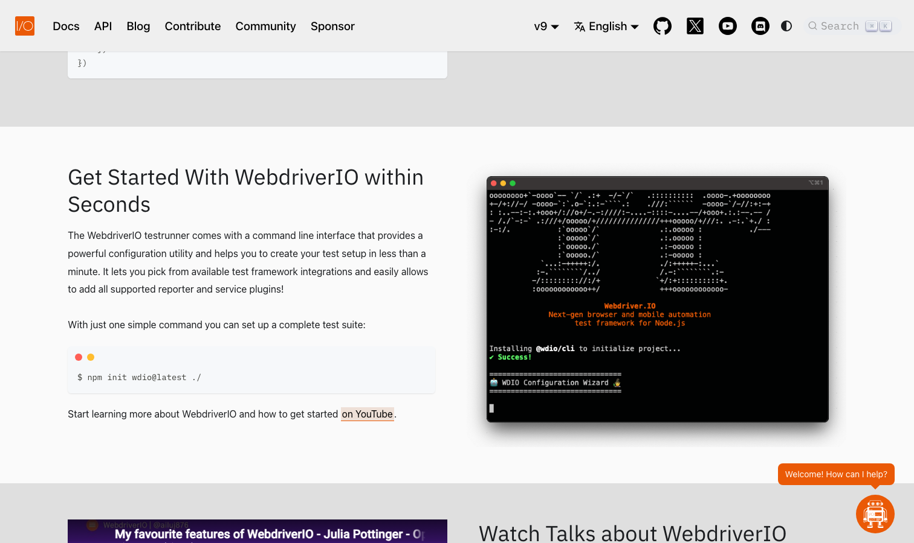

# WebdriverIO

> 选它等于保留了所有后路。

## 工具简介

WebdriverIO 是 Next-gen 测试框架，协议层支持 **WebDriver 和 DevTools 双栈**，可以切到 Playwright 或者 Puppeteer 当执行引擎——模块化程度高，Appium 移动端也能同框架驱动，一套框架管 Web、App、桌面三端。

社区活跃度在 Node 系常年第一梯队。用例能按设备、按浏览器分组，一次配置几十种环境批量跑，失败截图、测试报告、接进持续集成的路子都是现成的——**人少端多的团队维护成本压得最低**。

## 基本信息

| 项目 | 信息 |
| --- | --- |
| 适用端 | Web + APP + 桌面 |
| 出品方 | WebdriverIO（社区） |
| 工具形态 | 测试框架（Node.js，多协议） |
| 官网 | <https://webdriver.io/> |
| 项目地址 | <https://github.com/webdriverio/webdriverio>（9.8k+ star） |
| 开源协议 | MIT |
| 收费模式 | 开源免费（云服务商业） |

## 收录信息

- 收录自「测试开发技术」公众号文章《2026 年 UI 自动化工具大全，20 款主流工具一次看懂》《Web 自动化测试全景图：20 个主流 AI 自动化工具如何选？》（两篇均收录）
- GitHub 数据核验于 2026-10
- [返回 UI 自动化工具清单](./README.md)
