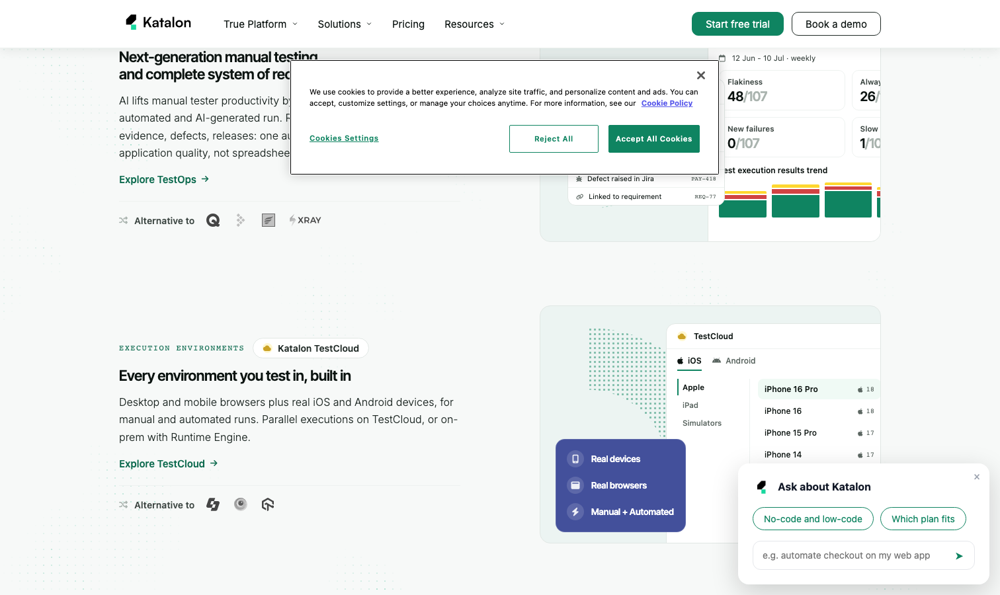

# Katalon Studio

> 中小团队想要省心全家桶，它是商业产品里性价比最高的那一档。

## 工具简介

Katalon Studio 是一体化测试平台——**低代码和代码双模式切换**，Web、API、移动、桌面全管，录制回放加对象仓库，自带报告和分析。

免费版功能就够用，中小团队想要「一个工具覆盖所有端」又不想自己搭框架栈，它是商业产品里性价比最高的那一档。对没有强代码文化的团队，从手工测试过渡到自动化的摩擦最小。

## 基本信息

| 项目 | 信息 |
| --- | --- |
| 适用端 | Web + APP + 桌面 + API（全端） |
| 出品方 | Katalon |
| 工具形态 | 一体化测试平台（低代码 + 代码） |
| 官网 | <https://katalon.com/> |
| 项目地址 | 闭源 |
| 收费模式 | 免费版 + Premium/Ultimate 订阅 |

## 收录信息

- 收录自「测试开发技术」公众号文章《2026 年 UI 自动化工具大全，20 款主流工具一次看懂》
- [返回 UI 自动化工具清单](./README.md)
