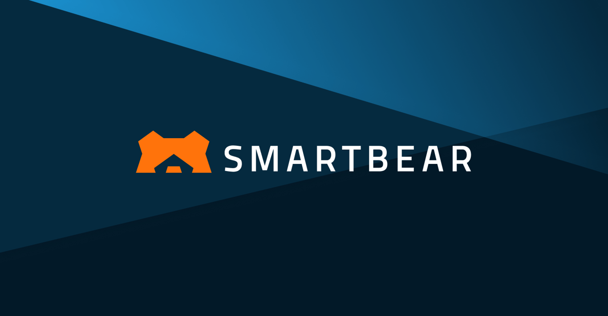

# TestComplete

> 大型企业桌面回归的主流选择。

## 工具简介

TestComplete 是 SmartBear 出品的商业测试平台，Web、桌面、移动三端全管——**对象识别引擎是看家本领**，AI 识别混着属性定位，老旧桌面系统（Delphi、VB、老 Win32 那种控件树乱七八糟的）的自动化它最能打。

价格不便宜，License 模式，大型企业桌面回归的主流选择。与同门 soapUI（接口）、ReadyAPI 形成 SmartBear 的测试产品线。

## 基本信息

| 项目 | 信息 |
| --- | --- |
| 适用端 | Web + 桌面 + APP（三端） |
| 出品方 | SmartBear |
| 工具形态 | 商业测试平台 |
| 官网 | <https://www.smartbear.com/product/testcomplete/> |
| 项目地址 | 闭源 |
| 收费模式 | 商业 License |

## 收录信息

- 收录自「测试开发技术」公众号文章《2026 年 UI 自动化工具大全，20 款主流工具一次看懂》
- [返回 UI 自动化工具清单](./README.md)
