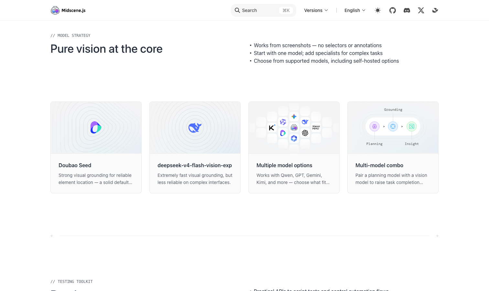

# Midscene（字节）

> 用视觉语言模型替掉选择器，中文文档齐全。

## 工具简介

Midscene 是字节 Web Infra 团队开源的视觉驱动 UI 自动化 SDK——用**视觉语言模型直接看渲染后的屏幕**，不依赖 DOM 和选择器。Web、Android、iOS、鸿蒙、桌面全支持，中文文档齐全，还能做成 Skill 挂给 AI 编程代理直接调。

按测试思路设计：YAML 写用例、自然语言写断言，跑完有可视化报告（AI 每一步点了哪里、为什么这么判断都能回放）；还提供浏览器扩展装上就能在页面上直接下指令体验。测试团队想把 AI 引进回归，它阻力最小——主力回归照样用 Playwright 或 Cypress，AI 层先做辅助断言。

## 基本信息

| 项目 | 信息 |
| --- | --- |
| 适用端 | Web + APP（Android/iOS/鸿蒙）+ 桌面（跨端） |
| 出品方 | 字节跳动 Web Infra |
| 工具形态 | 视觉驱动自动化 SDK |
| 官网 | <https://midscenejs.com/> |
| 项目地址 | <https://github.com/web-infra-dev/midscene>（15k+ star） |
| 开源协议 | MIT |
| 收费模式 | 开源免费（模型费用自负） |

## 收录信息

- 收录自「测试开发技术」公众号文章《2026 年 UI 自动化工具大全，20 款主流工具一次看懂》《Web 自动化测试全景图：20 个主流 AI 自动化工具如何选？》（两篇均收录）
- GitHub 数据核验于 2026-10
- [返回 UI 自动化工具清单](./README.md)
