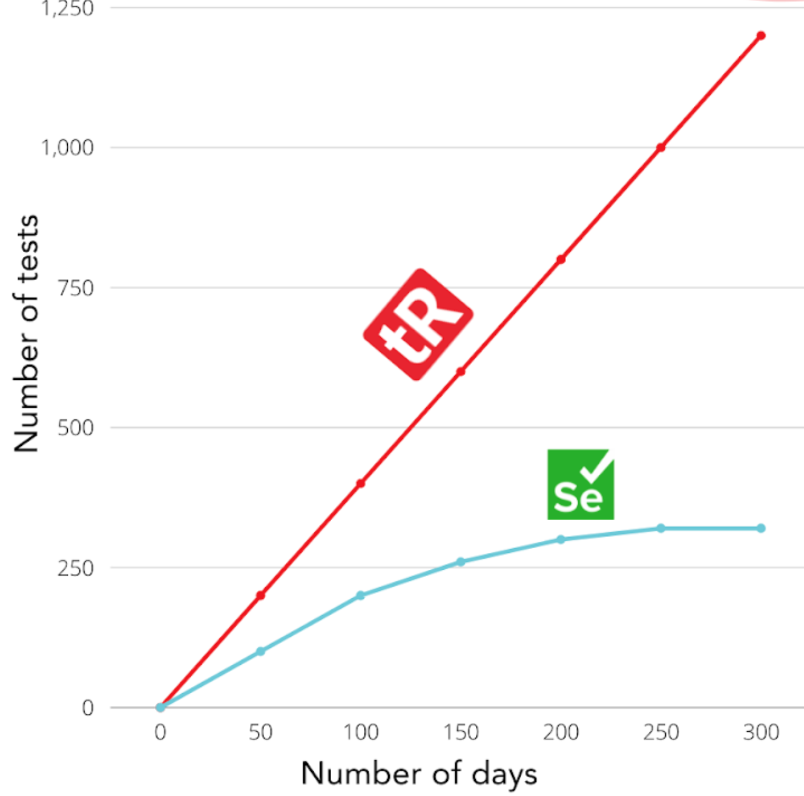

# testRigor

> 纯自然语言写用例，不碰 DOM 不写选择器。

## 工具简介

testRigor 是商业 AI 无代码测试的代表——**纯自然语言写用例**，「点击登录按钮，输入邮箱」这种句子直接就是用例，不碰 DOM 不写选择器，业务人员也能上手。

Web、移动、桌面、API 都支持，代价是订阅价格不便宜。它把「用例的可维护性」做到极致（文案变了大多数情况不影响），适合把业务人员拉进测试共建的团队。

## 基本信息

| 项目 | 信息 |
| --- | --- |
| 适用端 | Web + APP + 桌面 + API（全端） |
| 出品方 | testRigor |
| 工具形态 | AI 无代码测试平台 |
| 官网 | <https://www.testrigor.com/> |
| 项目地址 | 闭源 |
| 收费模式 | 商业订阅 |

## 收录信息

- 收录自「测试开发技术」公众号文章《2026 年 UI 自动化工具大全，20 款主流工具一次看懂》
- [返回 UI 自动化工具清单](./README.md)
