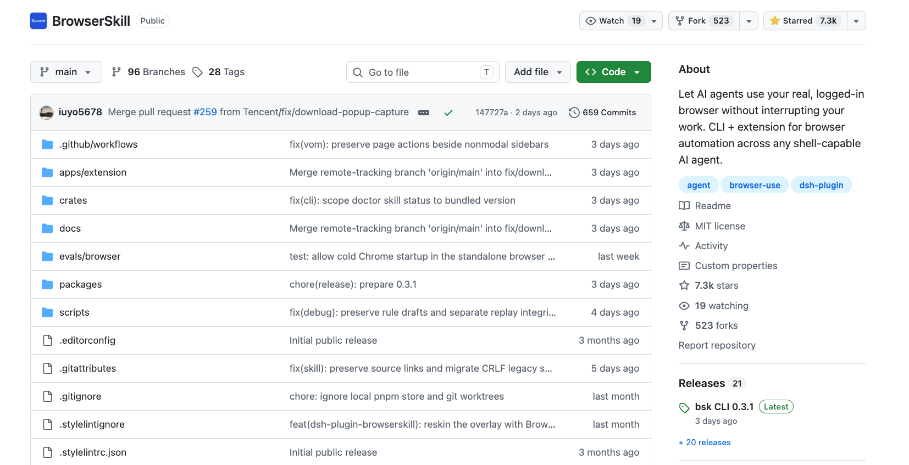

# UI 自动化工具（已收录 39 个）

> 工具整理自「测试开发技术」公众号两篇文章：《2026 年 UI 自动化工具大全，20 款主流工具一次看懂》与《Web 自动化测试全景图：20 个主流 AI 自动化工具如何选？》——两篇交集 11 款、合并去重 29 款，再补充 APP 端 6 款、桌面端 4 款，共 39 款。**按适用的端分四组：Web UI → APP UI → 桌面 UI → 跨端多端**，每个工具页的「基本信息」表里都标注了适用端。

**用法建议**：Web 新项目别犹豫，Playwright 起手；Selenium 留给遗留系统和极端兼容需求；Cypress 想清楚再选（前端自测是蜜糖，全域覆盖是枷锁）。给 Coding Agent 配手，对话式客户端用 Playwright MCP，终端 agent 长任务用 Playwright CLI 省 token。AI 原生引擎（Browser Use、Midscene 这批）临时任务和探索性测试已经很好用，回归主链路先在旁路跑三个月再定。**AI 自愈治的是维护的病，治不了用例的病**——用例设计和场景覆盖还是得人来。工具在趋同，真正拉开差距的，最后还是用例设计的功力。

## 一、Web UI 自动化

### 传统框架

| 序号 | 工具 | 适用端 | 一句话点评 |
| --- | --- | --- | --- |
| 01 | [Selenium](./01-selenium.md) | Web | 2004 年出道的老祖师，W3C WebDriver 标准的源头 |
| 02 | [Playwright](./02-playwright.md) | Web | 增长冠军，测试、脚本、AI 代理三类场景一等公民 |
| 03 | [Cypress](./03-cypress.md) | Web | 跑在浏览器里，时间旅行调试，前端团队的心头好 |
| 04 | [Puppeteer](./04-puppeteer.md) | Web | CDP 直连 Chrome，爬虫截图性能采集两栖选手 |
| 05 | [TestCafe](./05-testcafe.md) | Web（含移动浏览器） | 不装驱动，一套代码全浏览器并发跑 |
| 06 | [Nightwatch.js](./06-nightwatch.md) | Web | Node 系老牌，API 简断言内建，低调耐用 |
| 07 | [CodeceptJS](./07-codeceptjs.md) | Web（可挂 Appium） | 场景驱动用例像剧本，换引擎不重写用例 |

### AI 自愈平台

| 序号 | 工具 | 适用端 | 一句话点评 |
| --- | --- | --- | --- |
| 08 | [Mabl](./08-mabl.md) | Web | SaaS 低代码，元素变了自动修定位 |
| 09 | [Testim](./09-testim.md) | Web | AI 定位器鼻祖，每个定位器动态评估稳定性 |
| 10 | [QA Wolf](./10-qa-wolf.md) | Web | AI 加人工混合交付，产出并维护 Playwright 用例 |

### Agent 工具（MCP 与 CLI）

| 序号 | 工具 | 适用端 | 一句话点评 |
| --- | --- | --- | --- |
| 11 | [Playwright MCP](./11-playwright-mcp.md) | Web | 微软官方，无障碍树驱动浏览器，省 token |
| 12 | [Playwright CLI](./12-playwright-cli.md) | Web | 命令行调用，长任务比 MCP 更省 token |
| 13 | [BrowserSkill](./13-browserskill.md) | Web（登录态） | 腾讯出品，把已登录的浏览器借给 Agent |
| 14 | [BrowserAct](./14-browseract.md) | Web（风控场景） | 专攻反爬封锁，验证码风控的活它来 |
| 15 | [Browser MCP](./15-browser-mcp.md) | Web | 装个 Chrome 扩展就能用，门槛最低 |

### AI 原生引擎

| 序号 | 工具 | 适用端 | 一句话点评 |
| --- | --- | --- | --- |
| 16 | [Stagehand](./16-stagehand.md) | Web | Playwright 之上加自然语言接口，改动最小的 AI 化路径 |
| 17 | [Browser Use](./17-browser-use.md) | Web | 11 万 Star 现象级项目，浏览器整个交给大模型 |
| 18 | [Skyvern](./18-skyvern.md) | Web | 不看 DOM 看截图，canvas 老系统也能对付 |
| 19 | [Nova Act](./19-nova-act.md) | Web | 亚马逊官方 SDK，每步动作自评再执行 |
| 20 | [Notte](./20-notte.md) | Web | 感知层压缩 DOM，同样的任务 token 开销小一截 |

### 云浏览器

| 序号 | 工具 | 适用端 | 一句话点评 |
| --- | --- | --- | --- |
| 21 | [Browserbase](./21-browserbase.md) | Web（云） | 万级并发云浏览器，Stagehand 的母公司 |
| 22 | [Steel](./22-steel.md) | Web（云） | Apache-2.0 可自托管，数据不出门 |
| 23 | [Hyperbrowser](./23-hyperbrowser.md) | Web（云） | Browser Infra for AI Agents，随取随用 |

## 二、APP UI 自动化

两篇文章几乎全是 Web 端工具，APP 组为检索补充的主流款——iOS/Android 双端的事实标准和官方框架都在这里。

| 序号 | 工具 | 适用端 | 一句话点评 |
| --- | --- | --- | --- |
| 24 | [Appium](./24-appium.md) | APP（iOS/Android） | 移动端自动化的事实标准，WebDriver 协议 |
| 25 | [Airtest](./25-airtest.md) | APP（游戏优先）+ 桌面 | 网易出品，图像识别跨平台，游戏测试首选 |
| 26 | [Maestro](./26-maestro.md) | APP（iOS/Android） | YAML 写用例的轻量级，容忍 UI 延迟不 flaky |
| 27 | [Espresso](./27-espresso.md) | APP（Android 官方） | Google 官方，跑在 App 进程内，快而稳 |
| 28 | [XCUITest](./28-xctest.md) | APP（iOS 官方） | Apple 官方测试框架，XCTest 体系 |
| 29 | [Detox](./29-detox.md) | APP（React Native） | Wix 出品灰盒测试，RN 项目默认答案 |

## 三、桌面 UI 自动化

| 序号 | 工具 | 适用端 | 一句话点评 |
| --- | --- | --- | --- |
| 30 | [WinAppDriver](./30-winappdriver.md) | 桌面（Windows） | 微软官方，Selenium 协议驱动 Windows 应用 |
| 31 | [FlaUI](./31-flaui.md) | 桌面（Windows/.NET） | UIA 封装库，.NET 技术栈的桌面自动化主力 |
| 32 | [PyAutoGUI](./32-pyautogui.md) | 桌面（跨平台） | 图像识别 + 坐标操作，最简单直接的桌面自动化 |
| 33 | [pywinauto](./33-pywinauto.md) | 桌面（Windows/Python） | Python 的 Windows UI 自动化老牌库 |

## 四、跨端多端

一套工具管多端的平台与框架——预算和人手有限、要覆盖多端的团队从这里选。

| 序号 | 工具 | 适用端 | 一句话点评 |
| --- | --- | --- | --- |
| 34 | [WebdriverIO](./34-webdriverio.md) | Web + APP + 桌面 | 一套框架管三端，Node 系第一梯队 |
| 35 | [Robot Framework](./35-robot-framework.md) | Web + 桌面 + 嵌入式 | 关键字驱动，业务人员也能读懂用例 |
| 36 | [Katalon Studio](./36-katalon.md) | Web + APP + 桌面 + API | 低代码代码双模式，商业全家桶性价比最高 |
| 37 | [TestComplete](./37-testcomplete.md) | Web + 桌面 + APP | SmartBear 商业重炮，老旧桌面系统最能打 |
| 38 | [Midscene](./38-midscene.md) | Web + APP + 鸿蒙 + 桌面 | 字节开源视觉驱动，不依赖 DOM 和选择器 |
| 39 | [testRigor](./39-testrigor.md) | Web + APP + 桌面 + API | 纯自然语言写用例，业务人员也能上手 |

## 数据核验说明

- GitHub 仓库地址、star 数、开源协议经 GitHub API / gh CLI 实时核验，核验时间 **2026-10**；star 数随时间变化，以仓库页面为准。
- QA Wolf 的仓库已迁移为 `qawolf/cli`（原 `qawolf/qawolf`）；Maestro 仓库为 `mobile-dev-inc/Maestro`；Espresso 无独立仓库（androidx.test 的组成部分，页面给官方文档）。
- Notte 为 source-available 协议；Skyvern 为 AGPL-3.0（商用需评估）；BrowserAct 的 CLI 是商业产品、Skill 仓库开源。
- 无配图说明：Mabl、Maestro、Espresso 官网为 JS 渲染且无开源仓库，暂缺配图。

欢迎推荐遗漏的工具，参见[贡献指南](/about/contributing.html)。
